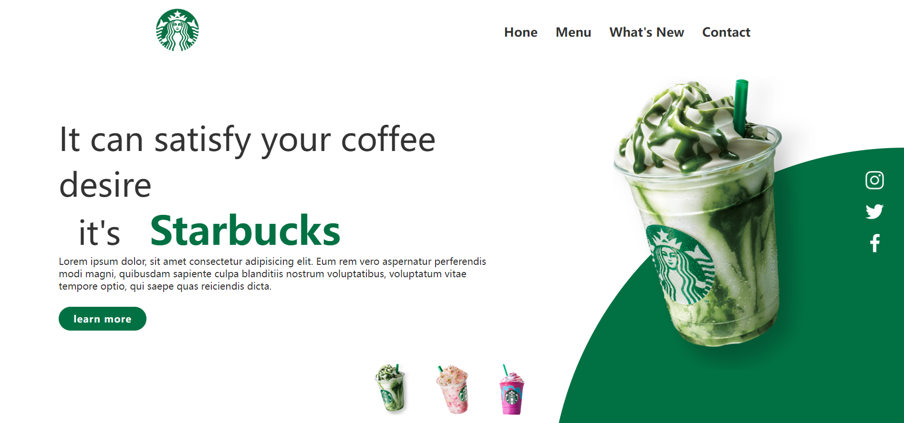
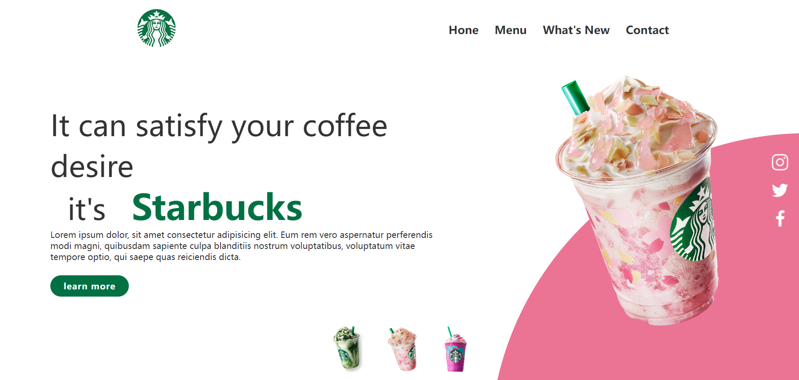

# Html Css Js 制作星巴克网页设计

星巴克网页设计 介绍
#### 网页设计与功能说明

1.  用html+css制作的简单网页，使用display：flex 进行布局

2.  点击项目下面饮品，切换饮品logo与背景颜色

#### js代码


```javascript
<script type="text/javascript">
    function imgSlider(anything){
	document.querySelector('.Starbucks').src = anything;
}

```


 #### 截图


 



